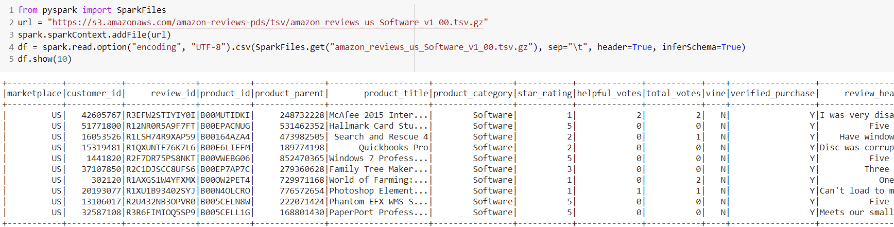
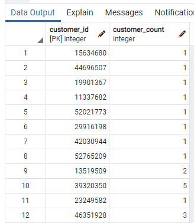
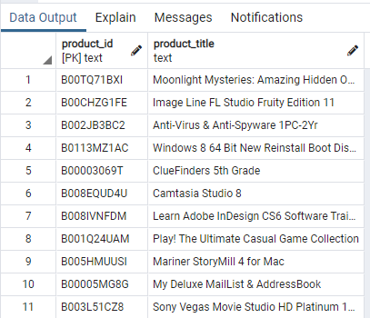
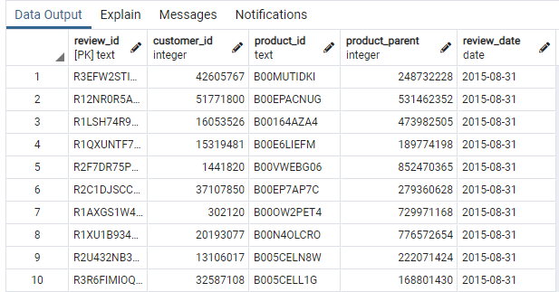
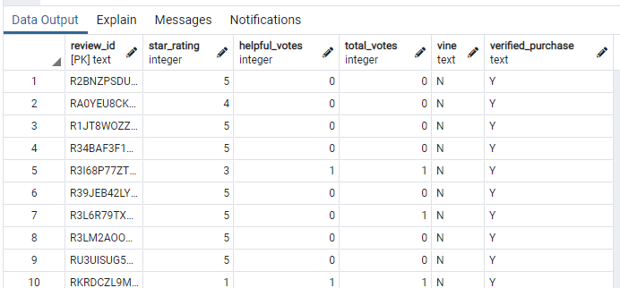
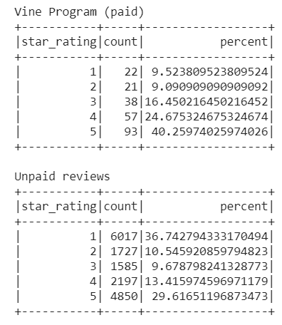
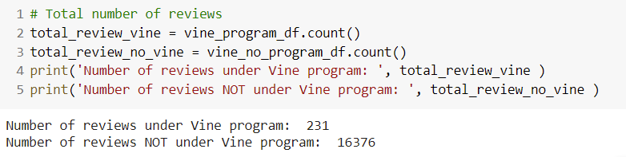

# Amazon_Vine_Analysis

## Overview

This project is the weekly challenge for week 16 of the Data Science Bootcamp. It allows us to put into practice and showcase the skills learned in Module 16 of the bootcamp.

### Purpose

To analyze Amazon reviews written by members of the paid Amazon Vine program and determine whether it biases the value of the reviews.

## Results

The following files are part of the challenge deliverables:

-[Amazon_Reviews_ETL.ipynb](./Amazon_Reviews_ETL.ipynb) : Jupyter book with Deliverable 1 ETL. Loaded from Google Colaboratory.

-[Vine_Review_Analysis.ipynb](./Vine_Review_Analysis.ipynb) : Deliverable 2, Vine reviews analysis. Loaded from Google Colaboratory.

### Deliverable 1: Perform ETL on Amazon Product Reviews

I created an AWD RDS database and, using Google Colaboratory, loaded the following dataset to it.

Steps can be followed in file [Amazon_Reviews_ETL.ipynb](./Amazon_Reviews_ETL.ipynb)

I elected to analyze the datase: 

`https://s3.amazonaws.com/amazon-reviews-pds/tsv/amazon_reviews_us_Software_v1_00.tsv.gz`

After loading, the DataFrame shape was (341931, 15).

Below is a snapshot of the Colab document with the dataframe loaded.



The dataset was transformed into 4 dataframes and then loaded into the Postgres database.

Here is the code use for each transformation:

```python
# Create the customers_table DataFrame
customers_df = df.groupby('customer_id').count().withColumnRenamed('count','customer_count')
# Create the products_table DataFrame and drop duplicates. 
products_df = df.select(['product_id','product_title']).drop_duplicates()
# Create the review_id_table DataFrame. 
# Convert the 'review_date' column to a date datatype with to_date("review_date", 'yyyy-MM-dd').alias("review_date")
review_id_df = df.select(['review_id','customer_id','product_id','product_parent', to_date("review_date", 'yyyy-MM-dd').alias("review_date")])
# Create the vine_table. DataFrame
vine_df = df.select(['review_id','star_rating','helpful_votes','total_votes','vine','verified_purchase'])
```

After loading, I used pgAdmin to check the tables had been loaded.

Below are snapshots for each table from pgAdmin.

#### Customer Table



#### Products Table



#### Review Table



#### Vine Table



### Deliverable 2: Determine Bias of Vine Reviews

In the Jupyter Notebook [Vine_Review_Analysis](/Vine_Review_Analysis.ipynb), I used pySpark to carry out the required analysis.

The transformations on the `vine_df` are summarized here:

```python
# Filter the data and retrieve all rows with total_votes>0
filtered_df = vine_df.filter(vine_df.total_votes>20)
# Retrieve all rows where helpful_votes/total_votes > 0.5
vine_filtered_df = filtered_df.filter((filtered_df.helpful_votes/filtered_df.total_votes)>0.5)
# filter those written as  part of Vine Program
vine_program_df = vine_filtered_df.filter(vine_filtered_df.vine=='Y')
vine_no_program_df = vine_filtered_df.filter(vine_filtered_df.vine=='N')
# Aggregate by star_rating
vine_summary_df = vine_program_df.groupby('star_rating').count().orderBy('star_rating')
no_vine_summary_df = vine_no_program_df.groupby('star_rating').count().orderBy('star_rating')
```

The summary tables can be seen below:



### Deliverable 3: Analysis of results

#### Number of reviews

The number of reviews under the Vine Program and those no-Vine were calculated as the counts of entries in the `vine_program_df` and `vine_no_program_df` dataframes.



#### 5 Star reviews

From deliverable 2 above, we see the number of 5-star Vine and non-Vine reviews.

|Stars| Vine Review | Non-Vine Review |
|:---:|:---:|:---:|
|5|93|4850|
|4|57|2197|
|3|38|1585|
|2|21|1727|
|1|22|6017|

#### 5 Star reviews distribution

We can also see the percentage of the total they represent:

|Stars| Vine Review | Non-Vine Review |
|:---:|:---:|:---:|
|5|40.26|29.62|
|4|24.68|13.42|
|3|16.45|9.68|
|2|9.09|10.55|
|1|9.52|36.74|

## Summary

From the distribution of the review stars in the Vine and Non-vine reviews, we can clearly see that Vine reviews are biased towards higher values of stars.

40.26% of Vine reviews within our criteria have 5 stars. 5-star reviews constitute only 29.62% of non-vine reviews.

Moreover, Vine reviews have a seemingly low percentage of 1- and 2-star reviews (just 18.61%), while 47.29% of non-vine reviews have 1- or 2-stars.

To further look into the positive bias created by the Vine program, we could run NLP analysis on a sample of the dataset and look at the Term Frequency of "positive" adjectives in the reviews.